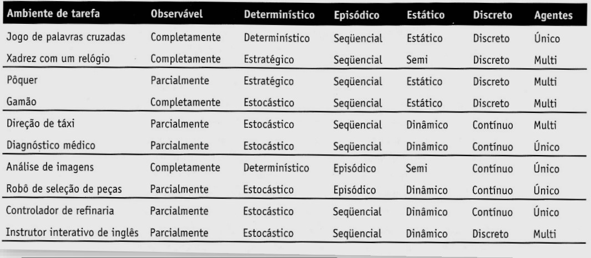

# AGENTES INTELIGENTES

1. [O QUE É UM AGENTE?](#o-que-é-um-agente)
2. [AGENTES INTELIGENTES](#agentes-inteligentes-1)
3. [RACIONALIDADE DOS AGENTES](#racionalidade-dos-agentes)
4. [METODOLOGIA DOS AGENTES](#metodologia-dos-agentes)
5. [AMBIENTES DO AGENTE](#ambientes-do-agente)

---

## O QUE É UM AGENTE?
Agente é qualquer entidade que:
- percebe seu ambiente por intermédio de **sensores** (exemplo: câmeras, mensagens de outro agente)
- age sobre o ambiente por intermédio de **atuadores** (exemplo: braço mecânicos, mensagens para outro agente)
- possui uma medida de desempenho que define o grau de sucesso das ações

Exemplos de agentes: 
- Humanos
    - Sensores: Olhos, visão, ouvidos
    - Atuadores: Mãos, pernas, boca
- Robôs
    - Sensores: Câmeras, detectores
    - Atuadores: Motores

A **função do agente** mapeia um histórico de percepções em ações.
f: P* --> A
O **programa do agente** executa numa arquitetura física para produzir a função do agente.

## AGENTES INTELIGENTES
- Operam em ambientes imprevisíveis, abertos e em constante mudança, onde ações têm alta chance de falhar.
- São capazes de realizar ações autônomas e flexíveis, incluindo reatividade, aprendizado, pró-atividade e habilidade social

## RACIONALIDADE DOS AGENTES
- A **Medidade de Desempenho** é usada para avaliar a sequência de estados do ambiente.
- Um agente é considerado **racional** se maximiza a sua medida de desempenho ao executar ações em um ambiente, dadas as percepções e o seu limite computacional (Hardware).

## METODOLOGIA DOS AGENTES
Decompor o problema em:
- Percepções;
- Ações;
- Objetivos;
- Ambientes;
- Outros agentes

Decompor o tipo de conhecimento em:
- Quais são as propriedades relevantes do mundo?
- Como o mundo evolui?
- Como identificar os estados desejáveis do mundo?
- Como interpretar suas percepções?
- Quais as consequências de suas ações no mundo?
- Como medir o sucesso de suas ações?
- Como avaliar seus próprios conhecimentos?

Indicar arquitetura e o método de resolução do problema.

## AMBIENTES DO AGENTE
- Completamente observável
    - Os sensores dão acesso a todo o estado atual do ambiente.
- Parcialmente observável
    - Os sensores dão acesso apenas a parte do estado devido a limitações deles.

- Determínistico
    - O ambiente é totalmente previsível.
- Estocástico
    - Existe algum tipo de aleatoridade.
- Estratégico
    - O ambiente é previsível, a menos das ações dos outros agentes.

- Episódico
    - As experiências do agente podem ser divididas em ciclos percepção-ação.
- Sequencial
    - As ações desempenhadas sobre o ambiente deverão influenciar as próximas ações do agente.

- Estático
    - O ambiente não muda enquanto o agente decide qual ação tomar.
- Dinâmico
    - O ambiente muda enquanto o agente decide qual ação tomar.
- Semi-dinâmico
    - O estado do ambiente não muda, mas a medida de desempenho do agente muda com o passar do tempo.

- Discreto
    - Os estados são enumeráveis.
- Contínuo
    - Os estados, percepções e ações podem assumir valores dentro de um intervalo contínuo, em vez de um conjunto finito ou contável de possibilidades.

- Conhecido
    - As leis que governam o ambiente são conhecidas de antemão. Dessa forma, as probabilidades de estados sucessores do ambiente após as ações do agente podem ser estimadas.
- Desconhecido
    - As leis que governam o ambiente não são conhecidas de antemão. Dessa forma, o agente necessitará aprender por conta própria a tomar boas ações.

- Único
- Multiagentes
    - Critério para diferenciar agentes inteligentes de comportamentos do ambiente: é possível perceber os agentes otimizando alguma medida de desempenho a partir de suas ações?

