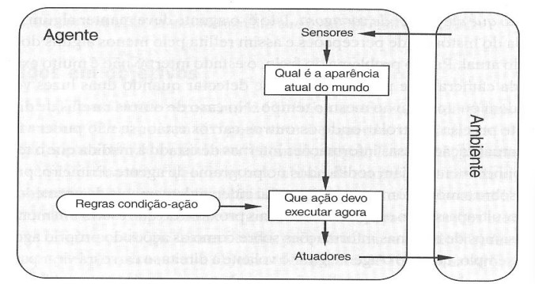
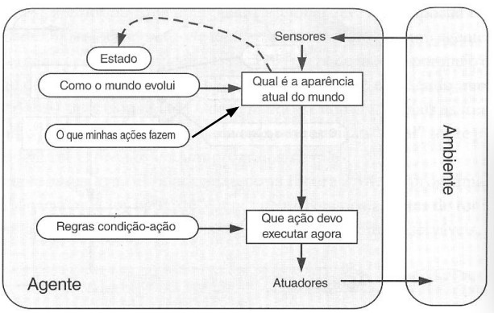
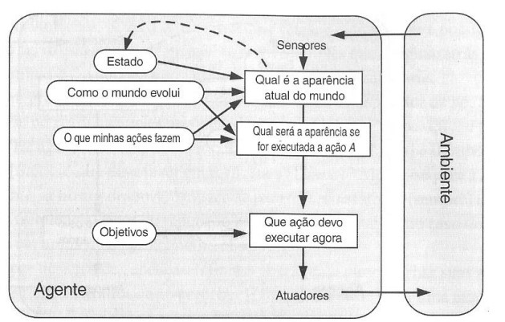
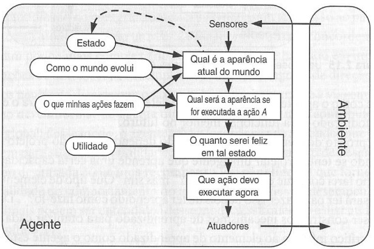
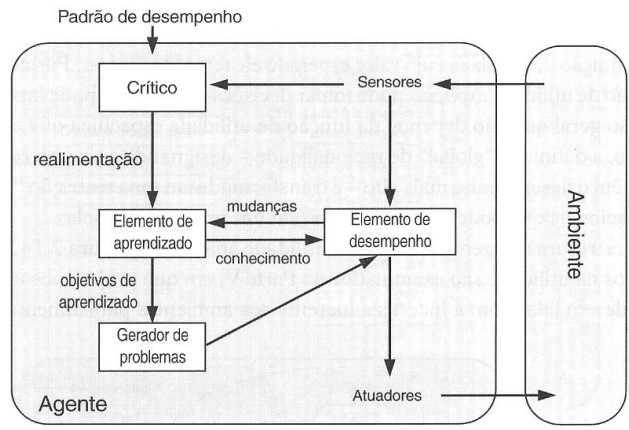

# AGENTES INTELIGENTES

1. [ESTRUTURA](#estrutura)
2. [IA CLÁSSICA](#ia-clássica)
3. [IA DISTRIBUÍDA (IAD)](#ia-distribuída-iad)

---

## ESTRUTURA

### Agente Reativo Simples
- Não há estado interno
- Inspiração em funções reativas de seres vivos
- Adequados quando recursos computacionais são limitados

### Agente Reativo baseado em Modelo
- Há estado interno
- Modelagem do ambiente ajuda a predizer resultado das ações

### Agente baseado em Objetivos
- mesmas características da estrutura anterior, acrescida de: objetivos que orientam as próximas ações a serem executadas

### Agente baseado na Utilidade
- Objetivos podem não ser suficientes para gerar comportamentos de alta qualidade
- A noção de utilidade, por sua vez, é mais refinada, pode considerar múltiplos fatores e gradações de satisfação
- Ex. carro autônomo:
    - Objetivo: levar o passageiro de A para B.
    - Utilidade: levar o passageiro de A para B com segurança, conforto, tempo reduzido...

### Agente com Aprendizagem
- Alguns tipos de aprendizagem
    - Supervisionada
    - Não supervisionada
    - Por reforço
    - Por descoberta

## IA CLÁSSICA
- Metáfora Psicológica
    - Uma pessoa ou entidade resolve o problema
    - Inteligência atomizada, restrita aos aspectos internos, que compõem sua própria racionalidade

## IA DISTRIBUÍDA (IAD)
- Inteligência: Centrada ou Distribuída?
    - Time de Futebol
    - Formigueiro
- Metáfora Sociológica
    - Agentes simples que juntos resolvem problemas complexos tendo ou não consciência do objetivo geral
    - O próprio ambiente pode ser modelado como um agente
- População de Agentes
    - Autônomos que podem interagir
        - Metáfora da organização social
        - realça a ação e interação entre os agentes
    - Agentes enquanto sociedade
- Sistemas multi-agente
    - Interação
    - Comunicação
    - Responsabilidades
    - Coordenação
    - Cooperação
    - Competição
- Quando usar?
    - Problemas complexos: Dividir e Conquistar
    - Problemas intrinsecamente distribuído: Administração de sistemas, controle de tráfego, ...
    - Problemas que exige tempo de resposta rápido: Processamento paralelo
    - Problema com domínios de conhecimento ou tarefas: Usina nuclear