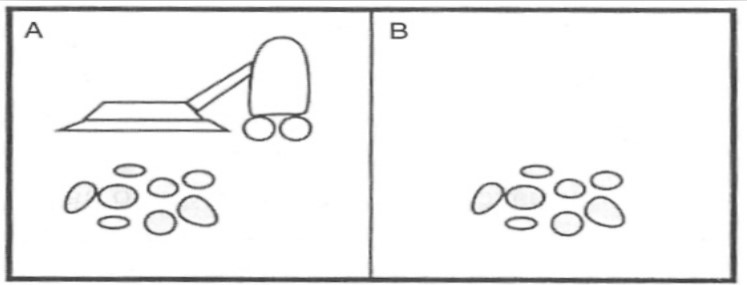
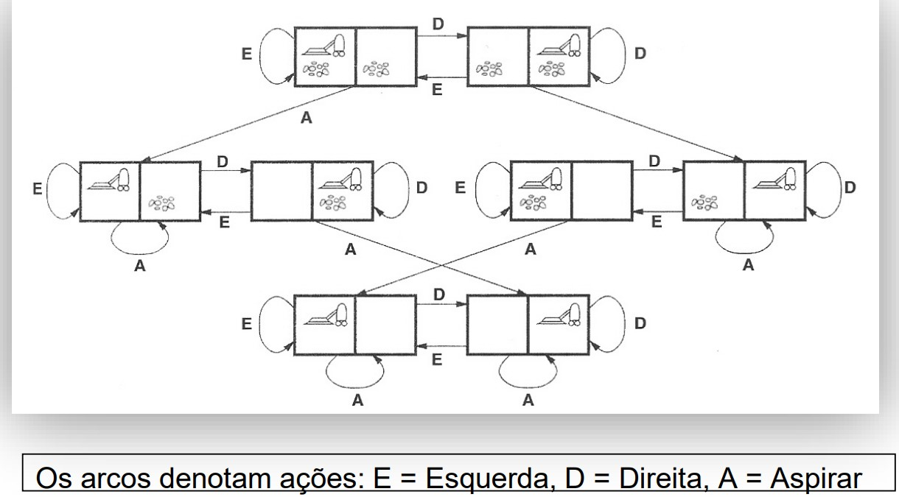

# RESOLUÇÕES DE PROBLEMAS

1. [AGENTES DE RESOLUÇÃO DE PROBLEMA](#agentes-de-resolução-de-problema)
2. [EXEMPLO](#exemplo)
3. [FORMULAÇÃO DE PROBLEMAS](#formulação-de-problemas)
4. [MINIPROBLEMAS E PROBLEMAS DO MUNDO REAL](#miniproblemas-e-problemas-do-mundo-real)
5. [EXEMPLO - MINIPROBLEMA](#exemplo---miniproblema)
---

## AGENTES DE RESOLUÇÃO DE PROBLEMA
- Agentes Reativos não conseguem operar bem em ambientes em que os mapeamentos entre percepções e ações são extensos ou complexos
- Por outro lado, Agentes Orientados a Objetivos levam em consideração suas futuras e os custos associados a estas ações
- Dessa forma, um agente de resolução de problemas é um tipo especial de agente orientado a objetivo que emprega representações atômicas dos estados do ambiente e estratégias para atingirem seus objetivos

## EXEMPLO
- Primeiros problemas por computador: prova automática de teoremas e jogos.
- A capacidade de cálculo e memória dos computadores são insuficientes para uma busca exaustiva entre todas as possibilidades em ambientes como Xadrez ou Go
- Um dos objetivos da IA: resolver problemas que o homem não sabe resolver facilmente ou em um tempo razoável, desde que sejam formalizados

## FORMULAÇÃO DE PROBLEMAS
- Elementos:
    - Estado Inicial
        - O estado inicial em que o agente começa
    - Função de Sucessor
        - Uma descrição das ações possíveis que estão disponíveis para o agente
    - Teste de Objetivo
        - Determina se um dado estado é um estado objetivo
    - Custo de Caminho
        - atribui um valor númerico a cada caminho

- Formulação mais comum: uso de uma função sucessor.
- Estado inicial e função sucessor: definem o espaço de estados do problema.
- Caminho no espaço de estados – sequência de estados que podem ser alcançados por uma seqüuncia de ações.

## MINIPROBLEMAS E PROBLEMAS DO MUNDO REAL
- Miniproblemas
    - Utilizados para ilustrar ou exercitar diversos métodos de resolução de problemas
    - Podem ter uma descrição concisa e exata - podem ser utilizados com facilidade por diferentes sistemas de busca, objetivando comparar o desempenho de algoritmos
- Problemas da vida real
    - Tendem a não representar uma única descrição consensual, mas é possível fornecer uma ideia geral das formulações

## EXEMPLO - MINIPROBLEMA
### Mundo do Aspirador de Pó

- Estados
    - O agente está em uma entre duas posições, cada uma das quais pode conter sujeira ou não.
    - Há 2 x 2^2 = 8 estados do mundo possíveis.
- Estado Inicial
    - Qualquer estado pode ser inicial
- Função de Sucessor
    - Gera os estados válidos que resultam da tentativa de executar as três ações (direita, esquerda, aspirar)
- Teste de Objetivo
    - Verificar se todos os quadrados estão limpos
- Custo do Caminho
    - Cada passo custa 1, e assim o custo do caminho é o número de passos do caminho
- Espaço de Estados

