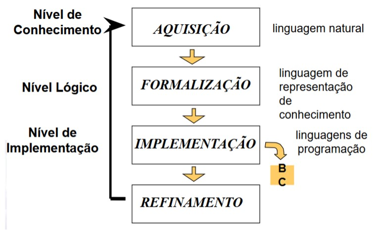

# REPRESENTAÇÃO DO CONHECIMENTO

1. [ESTUDO DO CONHECIMENTO](#estudo-do-conhecimento)
2. [PARADIGMAS](#paradigmas)
3. [RACIOCÍNIO](#raciocínio)
4. [COMO ADQUIRIR CONHECIMENTO?](#como-adquirir-conhecimento)
5. [CICLO DE VIDA DOS AGENTES BASEADOS EM CONHECIMENTO](#ciclo-de-vida-dos-agentes-baseados-em-conhecimento)

---

- Representação do Conhecimento é a estruturação daquilo que será empregado pelo sistema necessária para que um sistema computacional possa utilizar aspectos do conhecimento
- Sub-área de IA cujo objetivo principal é a busca de formalismos que possam ser usados para representar informação a respeito do mundo real.

## ESTUDO DO CONHECIMENTO
- Aprendizagem: fenômeno que produz um comportamento diferente a um estímulo externo devido a excitações recebidas no passado, sendo considerada uma forma de aquisição de conhecimento
- Conhecimento: ato de conhecer, ter ideia ou a noção de algo através de informações que lhe são apresentadas. Formado por três elementos
    - Sujeito (cognoscente): A pessoa ou entidade capaz de obter o conhecimento
    - Objeto (cognoscível): O que ou aquilo que se pode conhecer
    - Representação: O entendimento do objeto pelo sujeito
- Nos Sistemas Baseados em Conhecimento há uma separação clara entre conhecimento e raciocínio, ou seja, o controle do programa não se mistura com a especificação do conhecimento.

### Características
- É volumoso
    - Possui diversos aspectos, características e detalhes. A cada momento, novo conhecimento é gerado...
- De difícil caracterização
    - Não sabemos explicar com formalismo como,quando e de que forma o conhecimento foi adquirido, como também temos dificuldade de explicá-lo.
- Em constante mudança
    - É aperfeiçoado sistematicamente, crescendo e se modificando permanentemente.
- É individual e único
    - Cada indivíduo interpreta seu conhecimento de forma única.

### Características Desejáveis
- Generalizável
    - Vários pontos de vista do mesmo conhecimento concebem uma representação de modo que possa ser atribuído a diversas situações e interpretações.
- Representação passível de atualização/correção
    - O conhecimento é dinâmico, portanto, existe a necessidade permanente de atualização e ajustes do mesmo
- Robusta
    - De tal forma que seja possível a sua utilização mesmo não abordando todas as situações possíveis, ou seja, mesmo sendo incompleta e imprecisa.
- Compreensível
    - Compreensível ao ser humano e possível a sua interpretação

### O Estudo do Conhecimento
- A manifestação inteligente pressupõe para introduzir conhecimento na máquina e tratar consistência e redundância:
    - Aquisição,
    - Armazenamento e
    - Inferência do conhecimento

### Entidades
- Fatos: Verdades em algum mundo relevante. Essas são as coisas que queremos representar.
- Representação de fatos: com algum formalismo escolhido. Essas são as coisas que efetivamente seremos capazes de manipular.

## PARADIGMAS
### Conhecimento Procedural
- O conhecimento é representado em forma de funções/procedimentos. Normalmente é de difícil manutenção.
- Como resolver um problema
- Sequência de ações

### Lógica
- Linguagem formal que representa conhecimento de forma declarativa.
- Há separação nítida entre procedimentos de inferência gerais (independentes do problema) e a representação do conhecimento.
- Conhecimentos de longo termo, mais estáveis, são geralmente representados como implicações lógicas
- Conhecimentos de curto termo, mais instáveis, são geralmente representados como fatos.

### Redes
- O conhecimento é representado por um rótulo de grafos direcionados, cujos nós representam conceitos e entidades, enquanto os arcos representam a relação entre entidades e conceitos.

### Frames
- Semelhantes às rede semânticas, exceto que cada nó representa conceito e/ou situações.
    - Cada nó tem várias propriedades que podem serespecificadas ou herdadas pelo padrão.
    - Também possui forte relação com representações orientadas a objeto em linguagens de programação

### Árvore de Decisão
- conceitos são organizados na forma de árvores.

### Regras
- Sistemas de produção para codificar regras de condição/ação.

### Conhecimento Estatístico
- Uso de fatores de certeza, Redes Bayesianas, Lógica Fuzzy, etc.

### Casos
- Uma experiência passada, acumulando casos e tentando descobrir, por analogia, soluções para outros problemas.

### Esquemas Híbridos
- Qualquer representação do formalismo que emprega a combinação de esquemas de representação do conhecimento.

### MetaConhecimento
- Pode definir-se como conhecimento acerca do próprio conhecimento que se detém.
- Pode ser usado para:
    - Guiar a seleção, localização e uso de regras
    - Dar informação acerca das regras e do conhecimento
    - Justificar as regras melhorando a capacidade de explicação
    - Apoiar na detecção de erros ao introduzir novas regras
    - Facilitar a introdução de novo conhecimento

## RACIOCÍNIO
- É um processo de construção de novas sentenças a partir de sentenças existentes
- Categorias (Típicas) de Raciocínio
    - Dedução
    - Indução
    - Abdução
    - Analogia

### Dedução
- Processo de raciocínio no qual uma conclusão segue necessariamente das premissas supostas.
- Baseia-se na criação de novas sentenças a partir de premissas dadas como verdadeiras. A sentença
criada é necessariamente verdadeira.
- Uma das regras básicas da inferência da Lógica Dedutiva: regra do modus ponens (Latim: modo que afirma)
    - Se X é verdade e se X sendo verdade implica que Y é verdade, então Y é verdade

### Indução
- Uma conclusão sobre todos os membros de uma classe por meio do exame de apenas uns poucos
membros da classe.
- De maneira geral, raciocínio do particular para o geral.
- “Formalmente”:
    - Para um conjunto de objetos, X={a,b,c,d,...}, se a propriedade P é verdade para a, e se P é verdade para b, e se P é verdade para c,... então P é verdade para todo X

### Abdução
- Consiste em, dada uma premissa do tipo P → Q, e sabendo-se que Q é verdadeira, admite-se que, talvez, P seja verdade, ou seja, supõe-se, sem certeza, que P é verdade.
- É uma heurística para fazer “inferências plausíveis”.
- Propicia uma conclusão plausível consistente com a informação disponível, a qual pode de fato está errada.
- “Formalmente”:
    - Se Y é verdade e X implica em Y, então X é verdade

### Analogia
- Baseia-se na experiência de situações anteriores, das quais há verdades conhecidas. Se a situação que está sendo analisada assemelha-se a situações anteriores, então supõe-se, sem certeza absoluta, que as mesmas verdades também valem para esse caso.
- Parte do particular para o particular, não possui, do ponto de vista formal, uma força de prova, mas somente é verossímil ou provável.

### Sobre as Categorias
- O conhecimento novo baseado no raciocínio dedutivo é sempre verdade se as suposições são verdadeiras
- O conhecimento novo baseado em vários casos (indução) é geralmente verdadeiro desde que os sistemas estudados sejam bem comportados.
- Uma inferência baseada na abdução pode ser plausível mas deve carregar um fator de confiança para indicar a probabilidade de estar correta

## COMO ADQUIRIR CONHECIMENTO?
- Aprender
    - Várias Técnicas:
        - Aprendizagem Simbólica
        - Redes Neurais
        - Algoritmos Genéticos

- Explicitar: Engenharia do Conhecimento
    - Várias Técnicas:
        - Programação em Lógica
        - Sistemas de produção

## CICLO DE VIDA DOS AGENTES BASEADOS EM CONHECIMENTO
