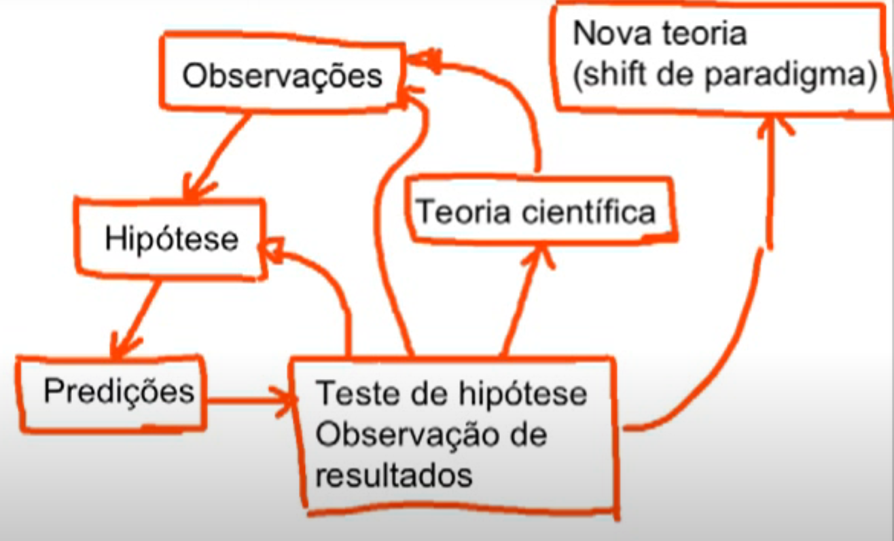
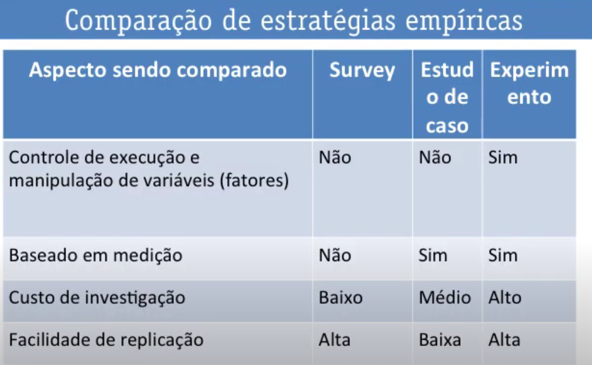

# CIÊNCIA
É um meio sistemátioco de construir e organizar conhecimento na forma de explicações testáveis e predições sobre o universo (fenômenos naturais)

## Ciência Moderna
3 grandes linhas:
- Ciências naturais (medicina, geologia)
- Ciências sociais (história, adm)
- Ciências formais (matemática e economia)

ciências aplicadas
- Aplicar o conhecimento na prática (engenharia e medicina)

## Cientista
- Desejo de conhecimento
- Nunca parar de questionar
- Curiosidade
- Duvidar de suas próprias certezza
- Não ter medo de errar

# MÉTODO
Procedimento, técnica ou meio de fazer alguma coisa, de acordo com um plano.
Processo organizado, lógico e sistemático de pesquisa.

## Método Científico
- Resolver problema em aberto
  - Melhorar (comparação) solução existente
  - Nova explicação (teoria)
    - Hipótese, teste da hipótese
  - Reprodução independente

# PESQUISA E DESENVOLVIMENTO
- Pesquisa é um processo de aprendizado
  - Não precisa haver ligação com utilidade
- Desenvolvimento busca alcançar funcionalidade
  - Inovação, ajuda de pesquisa pra mudança
  - Como fazer algo acontecer de modo útil, econômico, confiável

# TECNOLOGIA EM PROCESSAMENTO DADOS 
Análise e Desenvolvimento de Sistemas

Atende basicamente, necessidades de desenvolvimento, implantação e operação de aplicativos de software.

## Informática
Informação + automática

- Abrange o desenvolvimento de software, a arquitetura dos computadores e do hardware, as redes, cálculo númerico e a IA

# POR QUÊ **CIÊNCIA** DA COMPUTAÇÃO
- Rótulo melhor descritivo e mais abrangente, pra refletir de fato, atividades típicas
- Estabele credibilidade junto às ciencias naturais
- Apoia inovação: princípios que governam um problema podem levar a solução via outras áreas
- Princípios fundamentais oferecem linguagem que uniformizaz discussão de fenômenos naturais
- Computação e informação são os objetos básicos de CC

## Ciência Natural para Computação
- Muitos artigos trabalhavam com hipótese sem testes
- Argumento contra: 
  - O computador foi inventado e é fabricado pelo homem. Não é um objeto natural e sesu fundamentos derivam-se de áreas como Física e EE
- Argumentos a favor: 
  - A ciência de processos de informação e suas interações para o mundo
  - Áreas onde há tradicionalmente ciência estão presentes também em CC
  - Organização de príncipios fundamentais que dão nova perspectiva de CC
- Denning argumentava que CC:
  - Fundações matemáticas estenderam-se para sistemas, engenharia e design tornando CC "o estudo de processos algorítmicos que descrevem e transformam a informação"
  - Atividades em ciência emírica (algoritmos experimentais), engenharia e matemática
  - Computador é a ferramenta
    - Sete classes de princípios não excludente e presentes em várias tecnologias: computação, comunicação, coordenação, recuperação, automation, evaluation e design
  - Princípios (científicos) alimentam e direcionam a evolução das tecnologias
- Presença dos princípios nas linhas naturais e sociais da ciencia
  - IA e raciocínio humano, explicação do gargalo e mecânica dos fluidos, código executavel e código genético
  - A diferença é a busca por automação em CC
- Cruzamento entre CC e outras áreas (Bioinformática)

# CIENTISTAS
- Prêmio nobel de 1956 de física dividido em 3 pessoas: criadores dos Transistores
- Emil Post: Tabelas verdade
- Alonzo Church: influenciou LISP, linguagem formal matemática pra processamento de dados simbólicos
- Elizabeth Allen: Primeira mulher a ganhar o prêmio nobel por técnicas para otimização de compiladores

# TESTE DE TURING PARA IA
Testa a capacidade de uma máquina de exibir comportamento inteligente equivalente a um ser humano, ou indistinguível deste

Humano C conversa com A e B para descobrir quem é a máquina

# ALAN TURING
- Máquina de Turing, computador universal
- Primeiro programa de xadrez

# Prêmio Turing
- É concedido anualmente pela Associação para Maquinaria da Computação para uma pessoa selecionada por constribuições à computação. As contribuiçÕes devem ser duradoras e fundamentais no campo computacional
- 2007 era só reconhecimento, 2007-2013: 200 mil dólares, 2014: 1 milhão pago pelo google

# MÉTODO CIENTÍFICO
- Observações que irão gerar um novo conhecimento
- Processo cíclico e indutivo
- Empirismo: Conhecimento baseado em evidências observadas
- Lógica: argumentos devem ter sentido válido
- Toda verdade é transitória: nada pode ser provado cientificamente
- Passos:
  - OBERVAR
    - Questionamentos sobre o que foi observado
    - Uso de inferência indutiva e abdutiva para gerar hipóteses
  - HIPÓTESE
    - Palpites da resposta
    - Proposta da explicação
    - Para ser científica, precisa ser falseável/testável
    - Deve ser específica, precisa no que diz
    - Tem que haver algum meio de verificar as repercussões previstas
    - Prever algum fenômeno da natureza, se for verdade
    - Gera predições a partir da inferência dedutiva
  - EXPERIMENTOS
    - Testar a hípotese, revisar ou descartar ela
    - Verificar se as hipóteses estão de acordo com a realidade
    - Nenhuma evidência é para sempre
    - Usa inferência dedutiva para gerar novas observações
  - TEORIAS: Evidências que se acumulam
    - Podem ser refutadas ou não no futuro
- Mínimo do viés do pesquisador
- Correção de erros
- Verificação do que está sendo pesquisado
- Reprodutividade do método (para verificação do estudo)

# INFERÊNCIA
Processo de chegar a conclusões a partir de premissas

## dedutiva
- Premissas
- Deriva consequência lógica das premissa
- A conclusão é verdadeira se as premissas forem verdadeiras

## indutiva
- Observações concretas repetidas
- Generalização (em classes)
- Requer evidência empírica
  - Experiência dá suporte mas não há garantia de veracidade
- Exemplo: Todos os dias o sol nasce

## abdutiva (Chute)
- Concluir a partir do consequente
- Se chover, a grama irá molhar
- Se a grama estiver molhada, é porque choveu

# MÉTODO NA PESQUISA

## Experimentação
- Experimentar diferentes entradas (variáveis independentes) e observar como isso afeta a saída
- Controle rigoroso
- Fatores são manipulados
- Estabelecer causas
- Reproduzível
- Randomização

## Estudo de caso descritivo
- Observação e medição em **cenários reais**
- Não há controle
- Identificar fatores
- Estabelecer relacionamentos
- O contexto é importante demais para fazer experimentos em laboratório
 
## Estudo de caso comparativo
- Determinar e quantificar relacionamentos usando tratamentos diferentes, ou seja, duas situação diferentes

## Modelagem
- Modelo aproximado do mundo real
- Coisas do mundo real serão incluídas no modelo, mas existe coisas que serão cortadas
- "Todos modelos estão errados (diferentes do mundo real), mas são úteis"

## Survey
- Coleta sistemática de dados sobre opiniões, informações e etc das pessoas
- Memória de pessoas
- Questionário ou entrevista
- Trata de algo do passado
- Estudo retrospectivo
- Não há controle

Os métodos podem ser usado em combinação:
- Modelagem e experimentação
  - Casualidade e predição

# TRATAMENTO E ANÁLISE DE DADIS
- Estatística descritiva
  - Organiza e resume dados em números ou fráficos
  - Medidas de tendência ou posição central
  - Medidas de variação ou dispersão
- Estatística inferencial
- A partir dos dados, faz previsão ou produz conclusão sobre a população
  - Usa probabilidades para determinar nível de confiança em conclusões a que chegamos

# COMO REALIZAR UMA PESQUISA EMPÍRICA
- Identificar o business problem
- Identificar o technical problem (research question)
- Trabalhos relacionados
- Identificar o tipo de pesquisa empírica
- Escolher tipo de pesquisa empírica
- identificar os elementos do design
- identificar e criticar as técnicas
- Tipos de pesquisas empíricas
  - Experimento
  - Estudo de caso
  - Survey
- Execução da pesquisa
- Análise de dados
- Divulgação
- Uso

# REVISÃO SISTEMÁTICA DA LITERATURA
- É uma pesquisa científica em si
- Objetivo: sintetizar todo o conhecimento existente sobre uma questão de forma confiável e imparcial.
- Fichas de leitura
- Fontes
- Leitura rápida
- Leitura crítica ativa

# REPRODUÇÃO DA PESQUISA

## Replicação
- Repetir a mesma pesquisa com o mesmo método original, com alguns componentes estruturais modificados
- Generaliazção empírica
  - Testar para população diferentes
- Replicação independente
  - Cientista diferente fazendo a mesma pesquisa

## Reprodução
- Método diferente do original, mas com as mesmas bases teóricas

## Reanálise
- Mesmos dados do original com o mesmo procedimento/ferramental de análise ou outros para verificar os resultados

# OPEN SCIENCE
Tudo em um artigo científico deve ser passível de reprodução pelo leitor, incluindo resultados, tabelas, ferramentais, figuras e gráficos.

# REVISÃO POR PARES
- Revisor: colega nônimo, atuante no tema do artigo
  - Ler artigo de mod crítico
  - Avaliar a qualidade, rlevância e adequação de artigo para uma revista ou conferÊncia
  - Confirmar se resultados foram validados
  - Pode questionar ou criticar o conteúdo
  - Relatório de feedback
  - Autores podem argumentar ou questionar o resultado do revisor
- Editor: Rejeitará de pronto se fora de escopo, mal escrito, ciência fraca
- Anonimato das partes autores e revisores (double bind)
  - Artigo submetido não deve revelar autores
  - Relatório de revisão também
- Pares podem estar em qualquer lugar do planeta
- Pares farão leitura crítica
  - Sugestões para melhoria
  - RecomendaçÕes para o editor
- Editor repassa comentários e decisão para os autores (autor correspondente serve de contato)
- Evitar a publicação de erros, vieses ou fraudes.

# ÉTICA
- Falta de ética deixar de atribuir autoria para quem participou
- Atribuir autoria para quem fez nada também
- Autorização explicita por respondentes de questionário de survey
- Plágio e autoplágio (5 níveis)

# ESTATÍSTICAS

## Medidas de Tendência Central

Elas mostram valores típicos ou “representativos” de um conjunto de dados.

Média (ou valor esperado na probabilidade)
- É a soma dos valores dividida pelo número de observações.
- Representa o ponto de equilíbrio dos dados.

Mediana
- É o valor central quando os dados estão ordenados.
- Resistente a valores muito altos ou muito baixos (outliers).
Exemplo: se metade da população ganha até R$ 2.000, a mediana salarial é R$ 2.000.

Moda
- É o valor que mais se repete.
- Útil para categorias (ex.: a cor mais comprada de um carro).

## Medidas de Dispersão

Elas mostram o quanto os dados variam em torno da média.

Variância (σ² ou s²)
- Mede a dispersão ao quadrado dos dados em relação à média.
- Quanto maior a variância, mais espalhados estão os dados.

Desvio Padrão (σ ou s)
- É a raiz quadrada da variância.
- Mostra em unidades originais o quanto os valores, em média, se afastam da média.

Amplitude (range)
- Diferença entre o maior e o menor valor.
- Simples, mas sensível a valores extremos.

Coeficiente de Variação (CV)
- É o desvio padrão dividido pela média (em %).
- Permite comparar a variabilidade entre conjuntos de dados de escalas diferentes.

## Medidas Probabilísticas e Inferenciais

Ligadas a probabilidade e inferência estatística.

Esperança Matemática (ou valor esperado)
- É a média ponderada dos possíveis valores de uma variável aleatória, considerando as probabilidades.

Intervalo de Confiança (IC)
- É uma estimativa em forma de intervalo que provavelmente contém o valor verdadeiro do parâmetro da população.

Nível de Significância (α)
- É a probabilidade de rejeitar uma hipótese verdadeira (erro tipo I).

p-valor
- Probabilidade de observarmos um resultado tão extremo quanto o obtido, assumindo que a hipótese nula é verdadeira.

## Medidas de Associação

Medem relações entre variáveis.

Correlação (r de Pearson)
- Varia de -1 a +1 e indica se há relação linear entre duas variáveis.
- r = 0,9 (forte positiva), r = -0,8 (forte negativa), r ≈ 0 (quase nenhuma relação).

Covariância
- Mostra se duas variáveis variam juntas (positiva, negativa ou zero), mas o valor não é padronizado como a correlação.

## Teste de Hipótese

Um teste de hipótese é um procedimento estatístico usado para avaliar se existe evidência suficiente, a partir de uma amostra, para aceitar ou rejeitar uma suposição sobre a população.